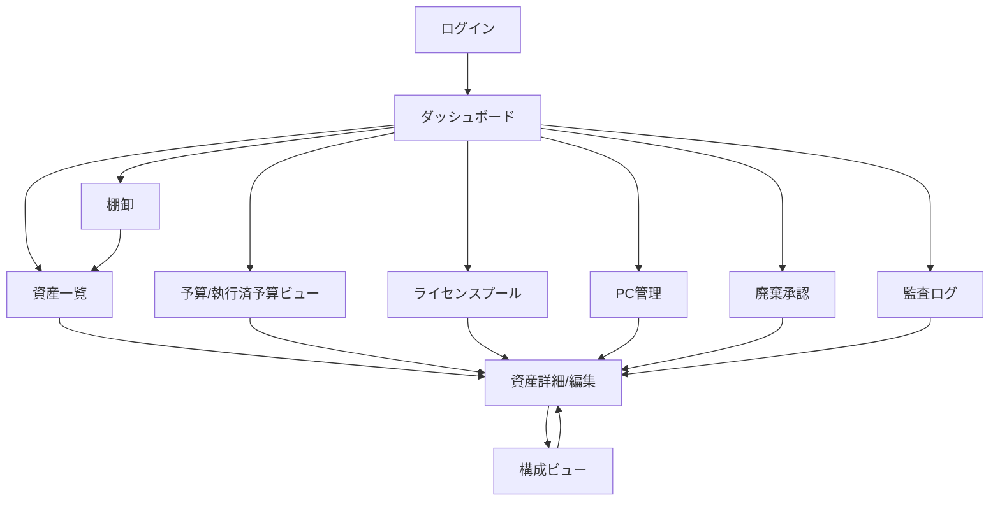

# 資産管理システム 画面遷移図（最小案）

## 1. 目的
本図は、要件定義ドラフトに対応した最小の画面導線を定義する。

## 2. 対象画面
- ログイン
- ダッシュボード
- 資産一覧
- 資産詳細/編集
- 構成ビュー
- ライセンスプール
- 予算/執行済予算ビュー
- PC管理
- 棚卸
- 廃棄承認
- 監査ログ

## 3. 画面遷移（Mermaid）

## 4. 主要導線の意図
- ダッシュボードを起点に、期限アラート/未紐付け資産から詳細へ到達できる。
- 資産詳細をハブにして、構成・予算・ライセンス・PC情報を更新できる。
- 予算未紐付け資産は、資産詳細から後付けで紐付け対応する。

## 5. 画面別の最低限要素
### 5.1 ダッシュボード
- 予算消化率
- 保守期限アラート
- 未紐付け資産件数

### 5.2 資産一覧
- 資産種別、状態、予算紐付けステータス
- 絞り込み（未紐付け/期限間近/種別）

### 5.3 資産詳細/編集
- 基本情報
- 構成参照/編集リンク
- 予算/執行済予算の後付け紐付け

### 5.4 構成ビュー
- 構成ヘッダ
- 構成明細（資産、ライセンス、保守）
- 履歴

### 5.5 予算/執行済予算ビュー
- 予算枠
- 執行済実績
- 資産紐付け状況

### 5.6 ライセンスプール
- ライセンス総数/使用数/残数
- 割当履歴

### 5.7 PC管理
- 利用者紐付け
- OS/スペック
- 保証期限

### 5.8 棚卸
- 棚卸対象一覧
- 差異入力
- 是正ステータス

### 5.9 廃棄承認
- 廃棄申請一覧
- 承認/差戻し
- 証跡確認

### 5.10 監査ログ
- 監査イベント検索
- 操作履歴追跡
