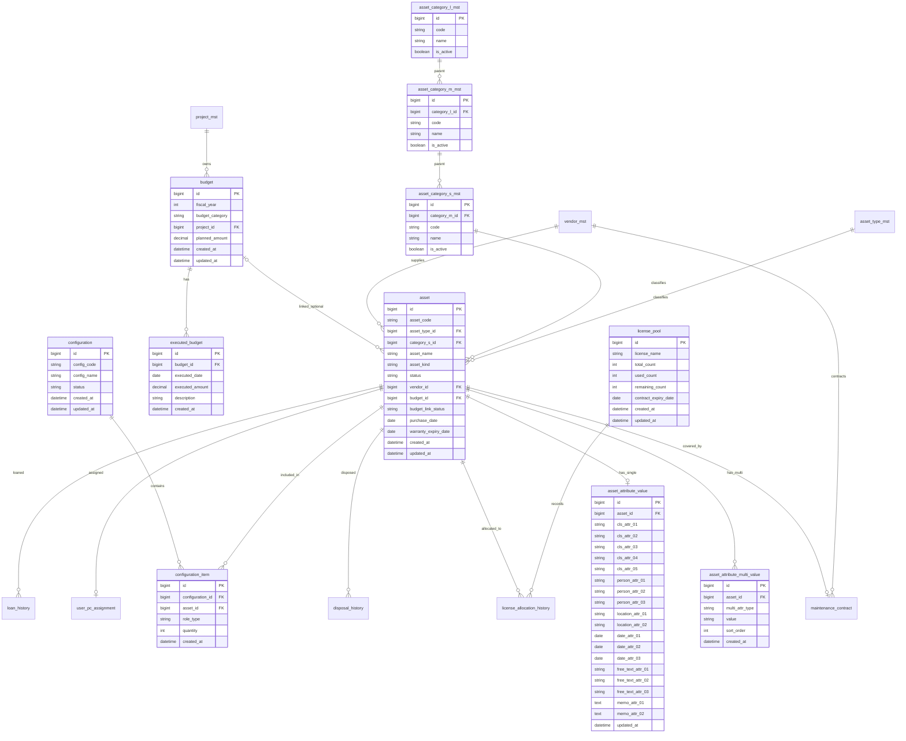

# 資産管理システム ER案（最小）

## 1. 方針
- 有形/無形を `asset` で統一管理し、種別で識別する。
- 分類は `大分類/中分類/小分類` の3階層で管理する。
- 構成は `configuration` と `configuration_item` の2層で表現する。
- 予算紐付けは任意とし、後付け更新を前提にする。
- 執行済予算は履歴（`executed_budget`）として保持する。
- 属性情報は20属性（個別分類5、人3、場所2、日付3、自由テキスト3、1:n情報2、メモ2）を保持する。

## 2. エンティティ一覧
- `asset`
- `asset_type_mst`
- `asset_category_l_mst`
- `asset_category_m_mst`
- `asset_category_s_mst`
- `configuration`
- `configuration_item`
- `license_pool`
- `license_allocation_history`
- `budget`
- `executed_budget`
- `project_mst`
- `vendor_mst`
- `maintenance_contract`
- `loan_history`
- `disposal_history`
- `user_pc_assignment`
- `asset_attribute_value`
- `asset_attribute_multi_value`

## 3. ER図（Mermaid）

## 4. 主要制約（最小）
- `asset.budget_id` は NULL 許容（予算未紐付け登録を許可）
- `asset.budget_link_status` は `未設定/設定済` を保持
- `asset.category_s_id` は必須（小分類まで必須入力）
- 廃棄済の `asset.status` は `configuration_item` への新規追加不可
- ライセンスは `total_count >= used_count` を満たす
- `asset_attribute_value.asset_id` は一意（資産ごとに単一値属性は1レコード）
- `asset_attribute_multi_value.multi_attr_type` は `MULTI_01/MULTI_02` のみ許容

## 5. 主要インデックス（最小）
- `asset(asset_code)` 一意
- `asset(status, budget_link_status, category_s_id)`
- `budget(fiscal_year, project_id)`
- `configuration_item(configuration_id, asset_id)`
- `license_allocation_history(asset_id)`
- `asset_attribute_multi_value(asset_id, multi_attr_type, sort_order)`

## 6. 補足
本ER案は概念/論理設計の初版であり、物理設計時に命名規約・正規化・監査項目を詳細化する。
